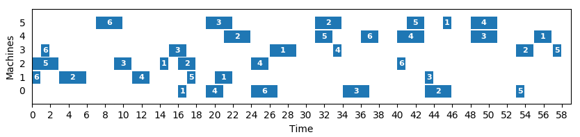

# Quantum Job Shop Scheduling Problem Solver

A heuristic approach on how to optimally schedule jobs using a quantum computer.

## Table of Contents
* [About the Project](#about-the-project)
* [Getting started](#getting-started)
  * [Prerequisites](#prerequisites)
  * [Installation](#installation)
  * [Quick Start](#quick-start)
* [References](#references)

## About The Project



*Note: Numbers in bars represent jobs*

Given a set of jobs and a finite number of machines, how should we schedule our jobs
on those machines such that all our jobs are completed at the earliest possible time?
This question is the job shop scheduling problem!

## Getting Started

### Prerequisites
* python 3.5 or later
* matplotlib (for results visualisation in [charts.py](charts.py))

```
pip3 install matplotlib
```

* D'Wave's libraries for interaction with QPU API
https://docs.ocean.dwavesys.com/en/latest/overview/install.html


### Installation
**NOTE:** If you are okay with using a simulator instead of a real QPU, jump to part 3.
1. Get free API Key at https://www.dwavesys.com/take-leap
2. Configure a solver at https://docs.ocean.dwavesys.com/en/latest/overview/dwavesys.html#dwavesys
3. Clone the repo

```
git clone https://github.com/mareksubocz/QuantumJSP
```

### Quick Start

```
python3 demo.py data/ft06.txt
```

## References
D. Venturelli, D. Marchand, and G. Rojo, "Quantum Annealing Implementation of Job-Shop Scheduling", https://arxiv.org/abs/1506.08479v2
